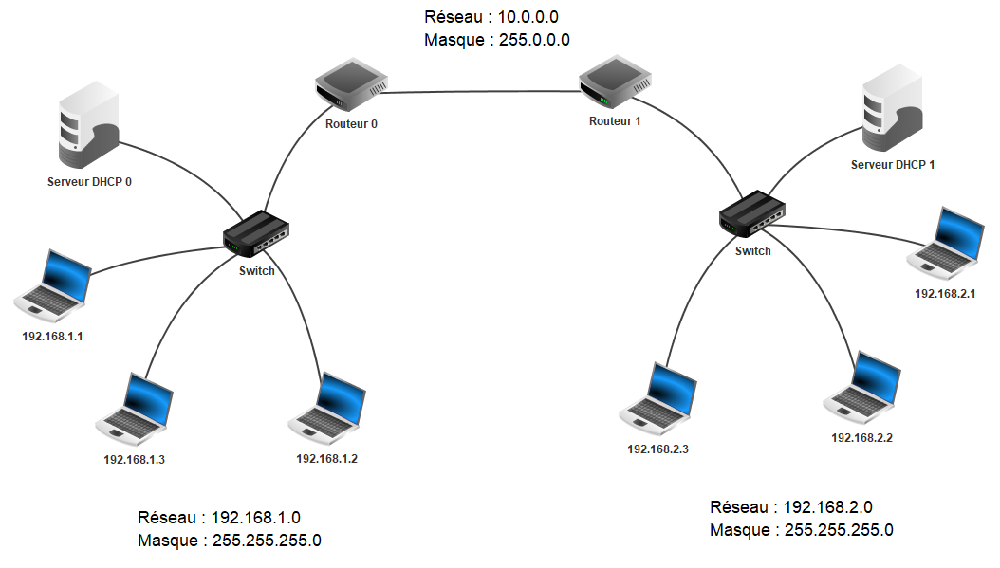

# Exercices

# **Interconnexion de deux réseaux.**

Pour chaque réseau, on choisit :

- Pour les adresses IP des routeurs : les dernières possibles.
- Pour l’adresse IP du serveur DHCP : la dernière possible, une fois celle des routeurs attribuées.

## **Compléter les adresses IP ci-dessous**

### **a) Pour le réseau 192.168.1.0**

- Passerelle :
- Serveur DHCP :

### **b) Pour le réseau 10.0.0.0**

- Passerelle « Routeur 0 » :
- Passerelle « Routeur 1 » :

### **c) Pour le réseau 192.168.2.0**

- Passerelle :
- Serveur DHCP :

# **Interconnexion de quatre réseaux.**

## **Compléter les adresses IP ci-dessous**

### **a) Pour le réseau 192.168.1.0 :**

Passerelle « Routeur 0 » :
Serveur DHCP :

### **b) Pour le réseau 10.0.0.0**

Passerelle « Routeur 0 » :
Passerelle « Routeur 2 » :

### **c) Pour le réseau 172.16.0.0**

Passerelle « Routeur 2 » :
Passerelle « Routeur 1 » :

### **d) Pour le réseau 192.168.2.0**

Passerelle « Routeur 1 » :
Serveur DHCP :

## **Tables de routage :**

### **Compléter ci-dessous pour le routeur 0 :**

| **Réseau de destination** | **Masque** | **Passerelle** | **Via l’interface** |
| --- | --- | --- | --- |
| 192.168.2.0 | 255.255.255.0 |  |  |
| 172.16.0.0 | 255.255.0.0 |  |  |

### Compléter ci-dessous pour le routeur 1 :

| **Réseau de destination** | **Masque** | **Passerelle** | **Via l’interface** |
| --- | --- | --- | --- |
| 192.168.1.0 | 255.255.255.0 |  |  |
| 10.0.0.0 | 255.0.0.0 |  |  |

### Compléter ci-dessous pour le routeur 2 :

| **Réseau de destination** | **Masque** | **Passerelle** | **Via l’interface** |
| --- | --- | --- | --- |
| 192.168.1.0 | 255.255.255.0 |  |  |
| 192.168.2.0 | 255.255.255.0 |  |  |