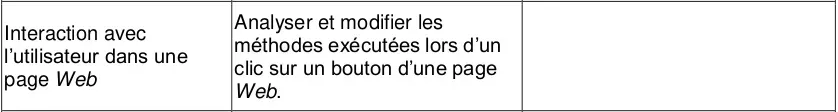

# Pages web et interactions



## Utilisation de Javascript

Jusqu'à présent, la page web envoyée par le serveur est :

1. Identique quel que soit le client;
2. Statique après réception sur l'ordinateur du client.


Le JavaScript va venir régler le problème n°2 : il est possible de fabriquer une page sur laquelle le client va pouvoir agir localement, sans avoir à redemander une nouvelle page au serveur.

Inventé en 1995 par [Brendan Eich](https://fr.wikipedia.org/wiki/Brendan_Eich) pour le navigateur Netscape, le langage JavaScript s'est imposé comme la norme auprès de tous les navigateurs pour apporter de l'interactivité aux pages web.

### **Exemple minimal - scripts embarqués**

Dans le script suivant (à copier-coller-enregistrer-visualiser), on introduit un objet `<button>` comportant un attribut `onclick` lié à un script déclaré dans le `<head>`.

```html
<!DOCTYPE html>
<html>
    <head>
        <meta charset="utf-8">
        <title>Un peu d'interaction</title>
        <script>
            function changeCouleur(){
                if (document.body.style.backgroundColor == 'green') {
                    document.body.style.backgroundColor = 'red';
                }
                else {document.body.style.backgroundColor = 'green';}
                document.getElementById("resultat").innerHTML=document.body.style.backgroundColor;
            }
        </script>
    </head>
    <body>
        <h1>Une page web extrêmement dynamique</h1>

        <p>
            <label>Changez la couleur d'arrière-plan:</label>
            <button type="button" onclick="changeCouleur();">Clic !</button>
        </p>
        <p>
        En JavaScript, le nom de la couleur choisie est :
        <span id="resultat"> blanc </p>
        </span>
    </body>
</html>
```

## **Exercice 1**

1. Modifier (en la simplifiant) le script `changeCouleur` pour qu'il prenne un paramètre `couleur` (comme en Python, à l'intérieur des parenthèses) et qu'il l'attribue à la couleur de fond.
2. Ajouter plusieurs boutons avec des choix de couleurs prédéfinies.

Comme pour les styles et CSS, il est préférable de séparer les scripts Javascript du code `html`. On préfèrera donc écrire le(s) script() dans un fichier `script.js` qu'on importe dans le `<head>` du document `html` ainsi:

```html
<script src="script.js"></script>
```

## **Exercice 2**

Créer un fichier `script.js` dans lequel vous copierez les scripts de l'exercice précédent. Actualiser également le document `html`.

La puissance du JavaScript permet de réaliser aujourd'hui des interfaces utilisateurs très complexes au sein d'un navigateur, équivalentes à celles produites par des logiciels externes (pensez à Discord, par ex.). Bien sûr, dans ces cas complexes, le serveur est aussi sollicité pour modifier la page.

**Pour en savoir plus**

- le guide JavaScript de la fondation Mozilla :
[https://developer.mozilla.org/fr/docs/Web/JavaScript/Guide](https://developer.mozilla.org/fr/docs/Web/JavaScript/Guide)
- le cours d'OpenClassrooms :
[https://openclassrooms.com/fr/courses/2984401-apprenez-a-coder-avec-javascript](https://openclassrooms.com/fr/courses/2984401-apprenez-a-coder-avec-javascript)

## **Exercice 3**

### **Énoncé**

L'objectif de cet exercice est de réaliser une deuxième page web, qui contiendra le quiz "Vrai/Faux" que vous avez préparé sur votre personnalité de l'Informatique.

La première page (la biographie) devra contenir un lien vers cette page-quiz, et réciproquement.

Il faudra adapter et compléter les extraits de code donnés dans les différentes parties.

### **Partie 1 : HTML**

Voici un exemple de code `html` pour une question du quiz:

```html
<div>
    <p>
        <strong>Question 1: </strong> HTML est un langage de programmation.
    </p>

    <p>
        <strong>Réponse :</strong>

        Vrai <input type="radio" name="q1" value="vrai">
        Faux <input type="radio" name="q1" value="faux">

        <span class="resultat">

        </span>
    </p>
</div>
```

---

- on utilise des éléments [`<input>`](https://developer.mozilla.org/fr/docs/Web/HTML/Element/Input) pour récupérer les réponses, sous forme de boutons radio. Ces deux éléments ont le même attribut `name` pour pouvoir les identifier.
- on utilise un élément `<span>` qui ne contient pas de texte pour l'instant: il contiendra plus tard la correction de la question, après lancement du script de correction. Il possède un attribut `class` pour avoir accès à tous les éléments identiques des questions du quiz.

**À faire:** insérer ligne 11 un élément `<input>` de type `button`. Lui ajouter un attribut `onClick` associé à la fonction JavaScript `correction()`.

### **Partie 2 : JavaScript**

Voici le script, à copier dans un fichier `script.js`.

```jsx
var questions = ["q1", "q2"];
var reponses = ["faux", "vrai"];

function correction(numero) {
    var radios = document.getElementsByName(questions[numero]);
    for(var i = 0; i < radios.length; i++){
        if(radios[i].checked){
            if(radios[i].value == reponses[numero]) {
                document.getElementsByClassName("resultat")[numero].innerHTML = "Juste!";
            }
            else {
                document.getElementsByClassName("resultat")[numero].innerHTML = "Faux!" ;
            }
        }
    }
}
```

---

- On crée deux listes contenant l'une les attributs `name` des boutons radios et l'autre les réponses aux questions.
- On récupère ensuite la liste des boutons radios par leur attribut `name`.
- On parcourt les boutons et s'ils sont sélectionnés (`checked`), on compare leur valeur aux réponses attendues, en actualisant les éléments de la `class` "resultat".

**À faire:** sauvegardez ce script dans un fichier `script.js` et importez le dans votre fichier `html`. Compléter correctement l'appel à la fonction `correction` dans le bouton créé précédemment.

**Ouverture:** modifier les fichiers `html` et `js` pour ne plus avoir qu'un seul bouton qui corrige **toutes** les questions.

### **Partie 2 : CSS**

Faites-vous plaisir.
