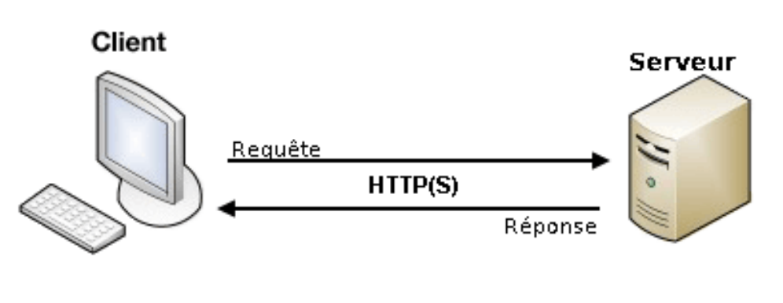

# Protocole HTTP

# HTTP le protocole du Web

Web

Les trois piliers du Web : HTTP, URL et HTML

Le Web est une application du réseau Internet qui désigne un réseau de sources d’information reliées par des liens hypertextes. Le Web fonctionne selon l’architecture client/serveur :

la machine client demande à la machine serveur une ressource identifiée par son adresse URL. Aux débuts du Web le client était commandé par un humain mais ce peut être un programme.

Figure 1: Architecture client serveur

Les inventeurs du Web, Tim Berners-Lee et Robert Caillau ont défini au CERN entre 1989 et 1991 ses
trois piliers HTTP, URL et HTML.

Point de cours 1

- Dans un échange sur le Web, le client envoie une demande ou requête à l’aide d’un logiciel
appelé navigateur a : le serveur est un logiciel installé sur une machine reliée en réseau à la
machine du client.
- Le protocole HTTP, acronyme d’Hypertext Transfer Protocol, est un protocole de la couche
application qui décrit le format des échanges de données entre un client et un serveur sur le Web.
    
    Un échange HTTP s’établit selon le schéma suivant :
    
    - Le client saisit une URL dans la barre d’adresse du navigateur, elle est résolue en adresse IP
    par le service DNS.
    - Mise en place d’une connexion TCP entre le client et le serveur.
    - Le client envoie une requête HTTP (format texte lisible par un humain).
    - Le serveur retourne une réponse HTTP, lue par le client. S’il y a un contenu, il est affiché
    par le navigateur du client.
    - Fermeture ou réutilisation (paramètre Keep-alive) de la connexion pour les requêtes
    suivantes.

Le protocole HTTP n’est pas sécurisé par défaut, il peut l’être par l’ajout du protocole SSL ou TLS et
on désigne par HTTPS sa version sécurisée. HTTP est un standard normalisé par l’IETF comme les
protocoles d’internet TCP et IP.

Source : https://developer.mozilla.org/fr/docs/Web/HTTP/Aper%C3%A7u

• Une adresse URL pour Uniform Ressource Locator identifie une ressource sur le Web. La
syntaxe des URL est standardisée, par exemple décomposons :
https://www.gnu.org/gnu/linux-and-gnu.fr.html :
– le protocole est https ;
– le nom de domaine sur Internet du serveur Web est gnu.org.
www.gnu.org est un sous-domaine servant d’alias pour le dossier public du serveur ;
Point de cours 1

• HTML pour Hypertext Markup Language est le langage de description des documents textes
disponibles sur le Web qui sont reliées entre eux par des liens hypertextes. Il s’agit d’un
langage à balises. En pratique, d’autres types de ressources sont accessibles sur le Web par une
URL : des images, des fichiers de données (aux formats CSV, JSON . . . ), des videos . . . Par
ailleurs les pages sont désormais réalisées en combinant HTML avec CSS pour la mise en forme,
le positionnement, certains effets visuels et Javascript pour la programmation événementielle
nécessaire à l’interactivité côté client.
Source : https://developer.mozilla.org/fr/docs/Glossaire/HTML

Ne pas confondre navigateurs comme Firefox, Edge, Chrome et moteurs de recherche comme Qwant, Google search, Bing

Source : [https://blog.octo.com/bd-le-https](https://blog.octo.com/bd-le-https)
