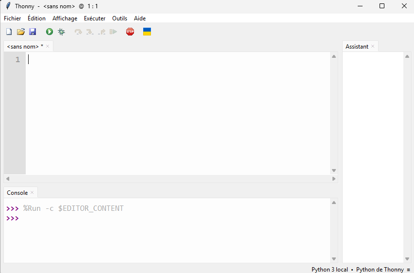
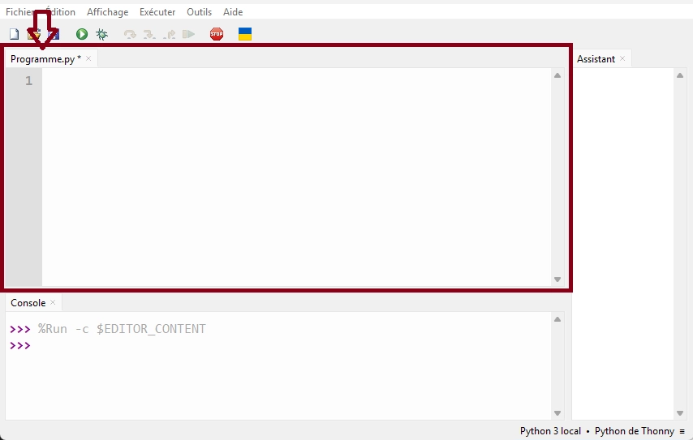
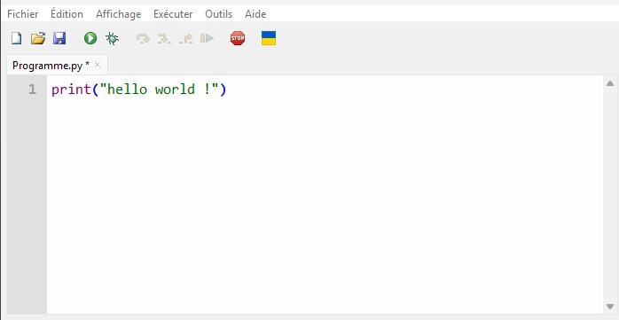

# NSI Activités

## Prise en main

Pour écrire nos programmes en Python, nous utiliserons le logiciel Thonny.
Une fois Thonny lancé, vous devriez obtenir quelque chose qui ressemble à cela :



Afin de bien démarrer, commencer par créer un dossier nommer **NSI** sur votre bureau.

Puis sauvegarder votre fichier, pour cela, cliquer sur l’onglet de Thonny :

> Fichier → Enregistrer
> 
> 
> Positionner vous dans le dossier nouvellement créé NSI de votre bureau → Nommer le fichier : Programme.py
> 


Thonny se divise en plusieurs fenêtres, mais la fenêtre qui va principalement nous intéresser, est la fenêtre centrale dont l’onglet doit maintenant être intitulé “Programme.py”



Maintenant dans cette fenêtre, saisissez exactement le programme suivant :

```python
print("hello world !")
```

Ce qui nous donne :



Cliquez sur le “bouton vert" en dessous de l’onglet “Edition” et “Affichage”, afin d'exécuter le programme qui vient d'être saisi.


Ce qui nous amène à notre deuxième fenêtre : la console

Où vous devez voir le message "hello world !" apparaître dedans.


## **Affectation**

A la suite de notre “hello world”, dans la fenêtre centrale de Thonny, saisissez le code suivant :

```python
point_de_vie = 15
```

Exécuter le code, comme précédemment.

Vous constaterez que rien n’a changé dans la console.

<aside  markdown="1">
💡

Le symbole `=` ici utilisé n'a **rien à voir** avec le symbole = utilisé en mathématique.
On dit qu'on a **affecté** à `point_de_vie` la valeur 32, et il faut se représenter mentalement cette action par l'écriture `point_de_vie ← 32`.

> La variable “point_de_vie” **prend la valeur** “32”.
> 
</aside>

Pour visualiser dans la console notre variable nouvellement créé du nom de “point_de_vie”, il faut réutiliser la fonction :

```python
print(X)
```

Où X est la valeur qu’on souhaite afficher dans notre terminale.

Dans notre cas, ça donnera :

```python
print(point_de_vie)
```

N.B. : Dans la suite la procédure sera toujours la même :
• Dans un premier temps vous saisissez votre programme
• Puis vous utiliserez la fonction “print(X)”, pour afficher le ou les variables à vérifier

<aside  markdown="1">

A moins qu’il y est une indication contraire, rajouter les différentes instructions à la suite des précédentes.


</aside>

Rajouter à la suite le programme suivant :

```python
point_de_vie = b
```

Que constatez vous dans la console lorsque vous exécuter le nouveau programme ?

Vous devriez obtenir une erreur dans la console, la dernière ligne est la plus importante ici :


<aside  markdown="1">
💡

Ici “defined” peut être traduit par : “**affecté”**  

</aside>

Par conséquent, avec quoi pouvez-vous remplacer b pour que cela fonctionne ?

## Variable

En première intention, il est possible d'expliquer le fonctionnement interne de l'affectation des variables par la *métaphore des tiroirs* :

Écrire l'instruction :

```python
>>> a = 2
```

Cela va provoquer chez l'ordinateur le comportement suivant :

- Est-ce que je possède **déjà** un tiroir appelé `a` ?
    - si oui, je me positionne devant.
    - si non, je crée un tiroir appelé `a`.
    - J'ouvre le tiroir et j'y dépose la valeur numérique 2. Si le tiroir contenait déjà une valeur, celle-ci disparaît (on dit qu'elle est **écrasée**).


Cette explication est suffisante pour aborder la notion de variable : c'est un mot (ou une lettre) qui va désigner une valeur.

Créer une variable avec *“votre nom”* pour qui on affecte la valeur *“votre âge”*.

Tester le programme pour voir s’il n’y a pas d’erreur à l’exécution.

---

## Calculs et types

Testez le programme suivant qui initialise les deux variables a et b avec des types différents :

```python
a = 5.2
b = 12
```

Après avoir exécuté ce programme, nous allons vérifier le type de ces deux variables.

<aside  markdown="1">
💡

Voici les types Python les plus fréquemment utilisés cette année:

| **Type Python** | **Traduction** | **Exemple** |
| --- | --- | --- |
| `int` | entier | `42` |
| `float` | flottant (décimal) | `3.1416` |
| `str` | chaîne de caractères (string) | `"NSI"` |
| `bool` | booléen (True ou False) | `True` |
| `tuple` | p-uplet | `(255, 127, 0)` |
| `list` | liste | `[0, 1, 2, 3, 4, 5]` |
| `dict` | dictionnaire | `{'Homer':43, 'Marge':41, 'Bart':12, 'Lisa':10, 'Maggie':4}` |
| `function` | fonction | `print` |
</aside>

Pour cela, nous utiliserons la fonction type(y), où y prendra les valeurs de “a” puis une seconde pour “b”.
La fonction type(y) donnera une une nouvelle valeur qui pourra être utiliser avec la fonction print(x) pour être afficher dans la console.

Vérifiez que le type de la variable *a* est float et le type de la variable *b* est *int*

<aside  markdown="1">
💡

### **Syntaxe classique et syntaxe Bonus**

L'incrémentation d'une variable `compteur` s'écrira en Python :

```python
>>> compteur = compteur + 1
```

Mais il existe aussi une syntaxe particulière, un peu plus courte :

```python
>>> compteur += 1
```

Cette syntaxe peut se ranger dans la catégorie des **bonus syntaxiques** : c'est bien de la connaître, c'est amusant de s'en servir, mais son utilisation n'est en rien obligatoire et peut avoir un effet néfaste, celui d'oublier réellement ce qu'il se passe derrière.

</aside>

Écrire le code en «classique» ou en «bonus» pour l'instruction suivante :
On initialise une variable `score` à 100 et on l'augmente de 15.

Écrire le code en «classique» ou en «bonus» pour l'instruction suivante :
On initialise une variable `cellule` à 1 et on la multiplie par 2.

Écrire le code en «classique» ou en «bonus» pour l'instruction suivante :
On initialise une variable `capital` à 1000 et on lui enlève 5%.

<aside  markdown="1">
💡

### Les opérations de Python

Dans le tableau ci-après, sont présentés les symboles utilisés pour les opérations de base.

| Opérations | Symboles | Exemples |
| --- | --- | --- |
| addition | + | 2 + 5 donne 7 |
| soustraction | - | 8 - 2 donne 6 |
| multiplication | * | 6 * 7 donne 42 |
| exponentiation (puissance) | ** | 5 ** 3 donne 125 |
| division | / | 7 / 2 donne 3.5 en python 3 |
| division | / | 7.0 / 2 donne 3.5 |
| reste de division entière | %(modulo) | 7 % 3 donne 1 |
| quotient de division entière | // | 7 // 3 donne 2 |
</aside>

Quelles sont les valeurs et les types des variables suivantes : d, e, f après l'exécution du programme ci-dessous

```python
import math
a = 5
b = 16
c = 3.14 / 2
d = b / a
e = b // a
f = b % a
```

*Vérifiez vos réponses à l'aide de la fonction print(…)*

Rajouter les lignes suivantes à la suite et donner les valeurs et les types des variables g, h et i après l'exécution du programme modifié.

```python
g = math.pow(a,2)
h = math.sqrt(b)
i = math.sin(c)
```

## **L'échange de variables**

Après l'incrémentation, une autre technique de base reviendra fréquemment dans nos codes : **l'échange de variables**.

Imaginons les variables suivantes :

```python
>>> a = 3
>>> b = 5
```

Le but est d'échanger les valeurs de `a` et de `b`.

▸ **Méthode naïve**

```python
>>> a = b
>>> b = a
```

Que valent `a` et `b` maintenant ?

Malheureusement :

```python
>>> a
5
>>> b
5
```

La variable `a` a été écrasée dès qu'on lui a donné la valeur de la variable `b`.

Comment la préserver ?

La situation est similaire au problème suivant : comment échanger le contenu de ces deux verres ?


La méthode est évidente : il nous faut un troisième verre.

Nous allons faire de même pour nos variables. Nous allons utiliser une variable **temporaire** (on parle aussi de variable **tampon**) pour conserver la mémoire de la valeur de `a` (par exemple) avant que celle-ci ne se fasse écraser :

```python
>>> a = 3
>>> b = 5
>>> temp = a
>>> a = b
>>> b = temp
```

Vous pouvez vérifier maintenant que les valeurs de `a` et de `b` ont bien été échangées.

<aside  markdown="1">
💡

### **Syntaxe classique et syntaxe Bonus**

L'échange de deux variables `a` et de `b` s'écrit donc :

```python
>>> temp = a
>>> a = b
>>> b = temp
```

Mais il existe aussi une syntaxe particulière à Python, bien plus courte :

```python
>>> a, b = b, a
```

C'est de nouveau de la *syntaxe bonus*. Cette syntaxe nous dispense de créer nous-même une troisième variable. Mais pas de miracle : en interne, Python crée lui-même cette variable temporaire. La simultanéité n'existe pas en informatique.

</aside>

Une petite erreur s'est glissée à Poudlard :

```python
>>> maison_Harry = "Serpentard"
>>> maison_Malfoy =  "Gryffondor"
```

Corriger cette erreur, de deux manières différentes.

## Caractères

Soit le programme suivant :

```python
a = "Hello"
b = "World"
mon_expression = a + b
```

Vérifiez avec la fonction print(…) que la variable *mon_expression* a bien pour valeur *HelloWorld*

Soit le programme suivant :

```python
mon_nombre = 5
res = f"Nombre de personnes : {mon_nombre}"
```

Vérifiez que la variable *res* a bien pour valeur la chaîne de caractères *Nombre de personnes : 5*

## Définition de fonction

Soit la fonction suivante :

```python
def ma_fonction(x):
    y = 3 * x + 2
    return y 

print(*ma_fonction(4))*
```

Après avoir réécrit et exécuter le programme ci-dessus, essayer de comprendre l’implication du 4 dans le code. Vous pouvez changer sa valeur pour confirmer votre théorie.

Soit la fonction suivante :

```python
def ma_fonction(x,b):
    y = 4 * x + b
    return y 
```

Quelle est la valeur renvoyée par cette fonction si on prend x = 3 et b = 3 ?
Vérifiez votre réponse en rajoutant puis modifiant en adéquation le print(…) de la dernière question.

## Condition & Tests

### Exo 1

Soit la fonction suivante :

```python
def annonce(num, prov, dest):
    if dest != "0":
        msg = f"le train n° {num} en provenance de {prov} et à destination de {dest}, entre en gare."
    else:
        msg = f"le train n° {num} en provenance de {prov} entre en gare. Ce train est terminus Triffouillis-les-Oies."
    return msg

mon_msg = annonce(4242, "Paris", "0")
```

Quelle est la valeur de la variable *mon_msg* après l'exécution de ce programme ?
Vérifiez votre réponse grâce à la fonction print(….).

### Exo 2

Soit la fonction suivante :

```python
def ma_fct(a,b):
    if a < 5 and b > 2 :
        return 42
    else :
        return 24

val = ma_fct(6, 3)
```

Quelle est la valeur de la variable *val* après l'exécution de ce programme ?
Vérifiez votre réponse.

### Exo 3

Soit la fonction suivante :

```python
def ma_fct(a,b):
    if a < 5 or b > 2 :
        return 42
    else :
        return 24

val = ma_fct(6, 3)
```

Quelle est la valeur de la variable *val* après l'exécution de ce programme ?
Vérifiez votre réponse.

### Exo 4

Soit la fonction suivante :

```python
def ma_fct(a,b):
    if a < 2 or b < 2 :
        return 42
    else :
        return 24

val = ma_fct(6, 3)
```

Quelle est la valeur de la variable *val* après l'exécution de ce programme ?
Vérifiez votre réponse.

## Multiple tests

### Exo 1

Soit la fonction suivante :

```python
def ma_fct(a):
    b = 0
    while a > 2:
        b = b + 1
        a = a - 2
    return b

val = ma_fct(6)
```

Quelle est la valeur de la variable *val* après l'exécution de ce programme ?
Vérifiez votre réponse.

### Exo 2

Soit la fonction suivante :

```python
def ma_fct(a):
    b = 3
    while a > 0:
        b = b + a
        a = a - 2
    return b

val = ma_fct(6)
```

Quelle est la valeur de la variable *val* après l'exécution de ce programme ?
Vérifiez votre réponse.

## Boucle d’affichage

### Exo 1

On désire écrire une fonction *rebours* qui permet d'afficher un compte à rebours à l'écran. Cette fonction prend en paramètre la valeur de départ.
Exemple : si on tape dans la console *rebours(5)*, on doit obtenir :

```python
5
4
3
2
1
0
```

Complétez la fonction *rebours* suivante :

```python
def rebours(n):
    while ...:
        print(n)
        ...
```

### Exo 2

Vous allez créer "un générateur automatique de punition" :
Écrivez une fonction *punition* qui prendra 2 paramètres : une chaîne de caractère et un nombre entier

Par exemple :
Si on passe comme paramètres à notre fonction : "Je ne dois pas discuter en classe" et 3
La fonction devra permettre d'afficher :

> Je ne dois pas discuter en classe
Je ne dois pas discuter en classe
Je ne dois pas discuter en classe
> 

### Exo 3

Écrivez une fonction *multi* permettant d'afficher une table de multiplication. Cette fonction devra prendre en paramètre la table désirée.
Par exemple si l'on passe le paramètre 3 à la fonction, la fonction devra permettre d'afficher :

```python
1 x 3 = 3

2 x 3 = 6

...

...

10 x 3 = 30
```
